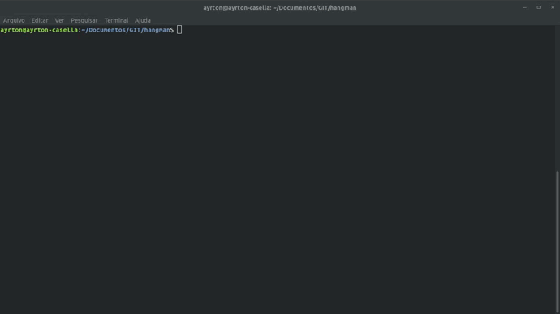

# Hangman
Hangman game cli using python 3

# Getting started

First of all, you have to install python3 into your system
    
    $ sudo apt-get install python3
    
After that, clone this Repository:

    $ git clone https://github.com/awcasella/hangman-cli-py.git

Change to directory you just cloned and run the script with python:

    $ cd hangman-cli-py
    $ python3 hangman.py

Now you can play along:

